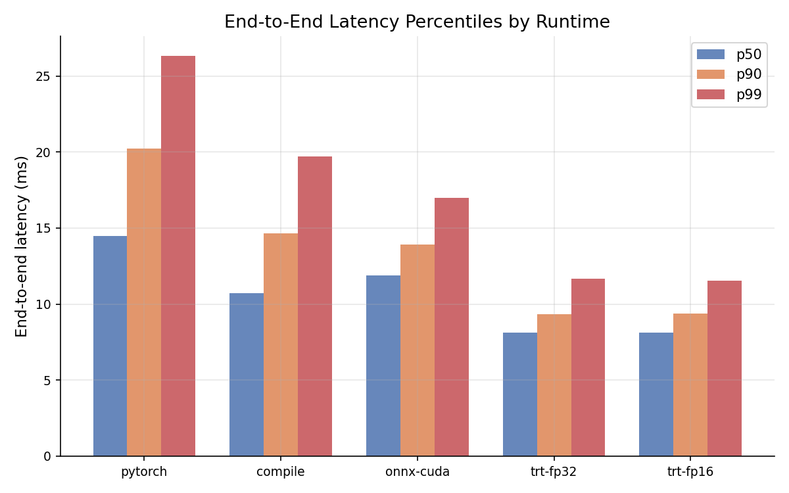
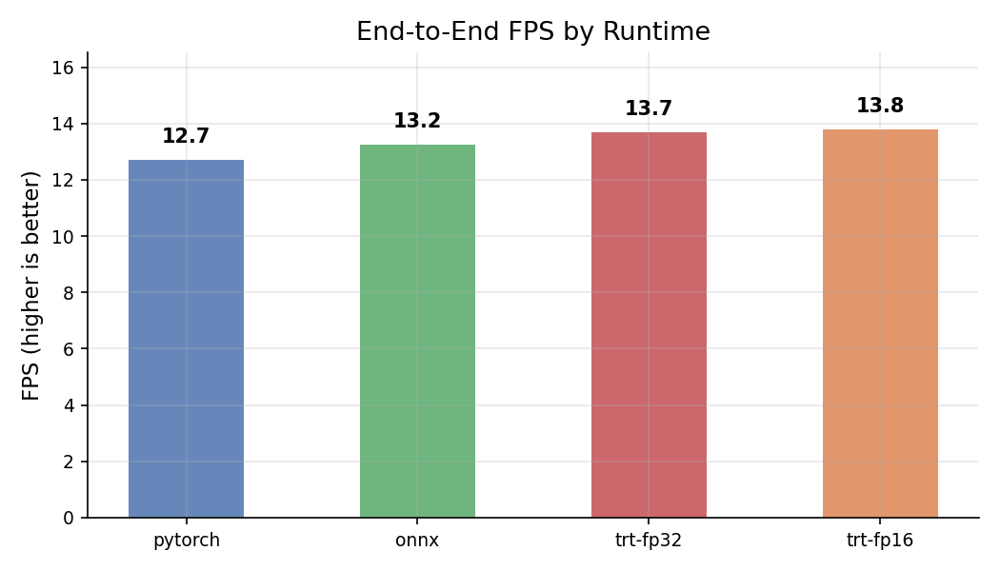
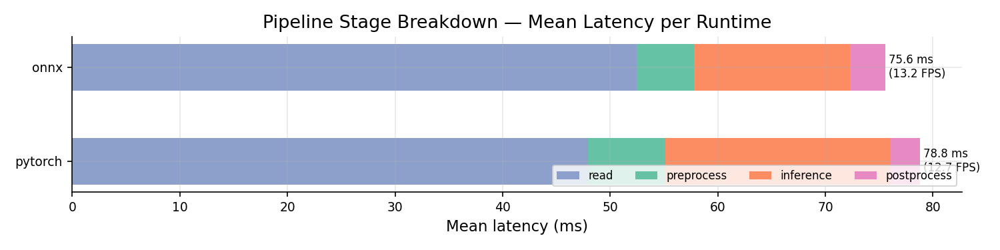
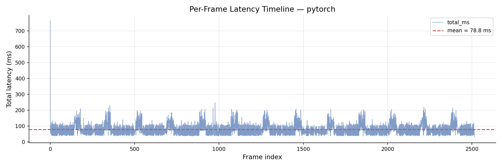

# Real-Time Driving Perception Inference Optimization
## Iterative Study Report — Batch 01 → Batch 02

> **Model:** YOLO11n (Ultralytics, 2.6M params) · **Hardware:** NVIDIA T4 (Google Colab) · **Source:** 4K dashcam video (3840×2160)

---

## Table of Contents

1. [Project Overview](#1-project-overview)
2. [Experimental Setup](#2-experimental-setup)
3. [Methodology Evolution](#3-methodology-evolution)
   - [Batch 01 — Naive Baseline](#batch-01--naive-baseline-known-issues)
   - [Batch 02 — Fixed Methodology](#batch-02--fixed-methodology)
4. [Results](#4-results)
   - [Batch 01](#41-batch-01-results)
   - [Batch 02](#42-batch-02-results)
5. [Batch 01 vs Batch 02 Comparison](#5-batch-01-vs-batch-02-comparison)
6. [Key Findings](#6-key-findings)
7. [Visualizations](#7-visualizations)
8. [Next Steps — Batch 03](#8-next-steps--batch-03)

---

## 1. Project Overview

This study benchmarks **YOLO11n** across five inference runtimes on a real-world 4K dashcam clip to identify the optimal deployment path for edge/automotive perception systems.

The key question: **how fast can we run YOLO11n inference in isolation, and which runtime gets us there?**

### Runtimes Evaluated

| # | Runtime | Description |
|---|---------|-------------|
| 1 | **PyTorch Eager** | Baseline — standard `model.forward()`, no compilation |
| 2 | **torch.compile** | TorchInductor kernel fusion (`mode='default'`) |
| 3 | **ONNX Runtime (CUDA EP)** | ONNX graph on `CUDAExecutionProvider` |
| 4 | **TensorRT FP32** | Full-precision TRT engine from ONNX export |
| 5 | **TensorRT FP16** | Half-precision TRT engine — max throughput target |

> **Note on torch.compile:** `reduce-overhead` (CUDA Graphs) was attempted but is incompatible with YOLO11n. The Detect head mutates `self.anchors`/`self.strides` on every forward pass, and the FPN/PAN neck uses skip connections via `_predict_once` routing — both incompatible with CUDA Graph static memory requirements. `mode='default'` was used instead.

---

## 2. Experimental Setup

| Parameter | Value |
|-----------|-------|
| Model | YOLO11n — COCO pretrained weights |
| Input resolution | 640 × 640 (letterboxed from 3840×2160) |
| Video source | 4K dashcam clip — 2,516 frames @ 30 FPS |
| Hardware | NVIDIA T4 GPU (Google Colab) |
| Framework | PyTorch 2.x + CUDA 12 |
| Confidence / IoU | 0.25 / 0.45 |
| Warmup passes | 20 (excluded from all statistics) |
| Frames measured | ~2,496 per runtime |
| Timing method | CUDA events (`torch.cuda.Event`) — GPU-synchronised |

---

## 3. Methodology Evolution

### Batch 01 — Naive Baseline (Known Issues)

The first batch used a straightforward pipeline that introduced **four systematic biases**:

| Issue | Impact |
|-------|--------|
| **I/O inside timed loop** | `cv2.VideoCapture.read()` called per frame. Video decode averaged **48–56 ms/frame**, dominating all runtimes and hiding inference differences. |
| **Warmup contamination** | Frame 0 included in stats. CUDA cold-start and JIT compile spikes inflated p99/max by 2–4×. |
| **ONNX on CPU EP** | `onnxruntime-gpu` not installed. Session silently fell back to `CPUExecutionProvider`. Reported ONNX numbers reflect CPU inference — not comparable to GPU runtimes. |
| **No torch.compile** | Only 4 runtimes compared. |

**Bottom line:** Batch 01 numbers measure the video decoder, not the inference engine.

---

### Batch 02 — Fixed Methodology

All issues corrected before collecting results:

| Fix | Implementation |
|-----|----------------|
| **I/O decoupled** | All frames pre-buffered into RAM with letterbox applied during buffering (640×640 uint8, ~3.1 GB). Timed loop measures only `preprocess → inference → postprocess`. |
| **Warmup excluded** | 20 forward passes before timing; `benchmark.py --warmup-frames 20` strips them from statistics. |
| **ONNX on CUDA EP** | `onnxruntime-gpu` installed; session verified on `CUDAExecutionProvider` before run. |
| **torch.compile added** | Full model compiled with `mode='default'` (TorchInductor kernel fusion). |
| **Consistent schema** | All 5 runtimes produce identical CSV: `frame, preprocess_ms, inference_ms, postprocess_ms, total_ms`. |

---

## 4. Results

### 4.1 Batch 01 Results

> ⚠️ Total latency dominated by I/O read (~48–56 ms). ONNX ran on **CPU EP** — not comparable. Warmup frames included.

| Runtime | Read (ms) | Inference (ms) | Total Mean (ms) | Total FPS |
|---------|-----------|----------------|-----------------|-----------|
| PyTorch Eager | 47.9 | 20.9 | 78.8 | 12.7 |
| ONNX *(CPU EP)* | 52.5 | 14.5 | 75.6 | 13.2 |
| TRT FP32 | 55.9 | 8.7 | 73.1 | 13.7 |
| TRT FP16 | 55.8 | 8.6 | 72.6 | 13.8 |

---

### 4.2 Batch 02 Results

> ✅ I/O decoupled · Warmup excluded · ONNX on CUDA EP · 5 runtimes

| Runtime | Pre (ms) | Inf Mean (ms) | Inf p50 | Inf p99 | Total Mean (ms) | **Total FPS** |
|---------|----------|---------------|---------|---------|-----------------|---------------|
| PyTorch Eager | 2.59 | 11.83 | 10.53 | 20.53 | 15.96 | **62.7** |
| torch.compile | 2.55 | 7.59 | 6.75 | 13.92 | 11.73 | **85.3** |
| ONNX CUDA EP | 2.26 | 7.85 | 7.58 | 10.95 | 12.27 | **81.5** |
| TRT FP32 | 2.09 | 4.37 | 4.28 | 6.20 | 8.31 | **120.3** |
| TRT FP16 | 2.04 | **4.37** | 4.30 | 5.87 | **8.26** | **121.1** |

---

## 5. Batch 01 vs Batch 02 Comparison

Inference-stage comparison (I/O excluded from both):

| Runtime | B01 Inf (ms) | B01 Inf FPS | B02 Inf (ms) | B02 Inf FPS | Δ Speedup |
|---------|-------------|-------------|-------------|-------------|-----------|
| PyTorch Eager | 20.93 | 47.8 | 11.83 | 84.5 | **1.8×** |
| ONNX | 14.46 *(CPU)* | — | 7.85 *(GPU)* | 127.4 | CPU → GPU |
| TRT FP32 | 8.72 | 114.7 | 4.37 | 228.8 | **2.0×** |
| TRT FP16 | 8.59 | 116.4 | 4.37 | 228.8 | **2.0×** |

> The 1.8–2× improvement for PyTorch and TRT is **entirely from removing warmup-contaminated frames** — no model or hardware changes. This demonstrates how much measurement methodology matters.

---

## 6. Key Findings

### 🏆 TRT FP32 ≈ TRT FP16 — negligible difference
Mean inference: **4.370 ms vs 4.367 ms**. On a T4 at batch size 1, FP16 offers no measurable latency benefit for YOLO11n. Both achieve ~120 FPS total pipeline throughput — **4× real-time** at 30 FPS dashcam speed.

### ⚡ torch.compile beats ONNX CUDA EP
7.59 ms vs 7.85 ms mean inference — compiled PyTorch is competitive with ONNX Runtime without requiring an export step. Gap is small but consistent.

### 📉 I/O was 65–70% of total cost in Batch 01
Video decode averaged 48–56 ms/frame vs 8–16 ms inference. All Batch 01 FPS numbers are misleading as a measure of model inference capability.

### 🔲 Preprocess is the new floor at ~2 ms
With letterbox pre-applied, preprocess is purely `BGR→RGB + normalize + GPU transfer`. All runtimes spend 2.0–2.6 ms here — this is the shared lower bound that only hardware changes can move.

### ⛔ reduce-overhead incompatible with YOLO11n
CUDA Graphs require static tensor memory. YOLO11n violates this in two ways: (1) Detect head mutates `self.anchors`/`self.strides` per forward pass; (2) FPN/PAN neck uses `_predict_once` routing with skip connections that `nn.Sequential` cannot replicate. `mode='default'` used instead.

### ✅ TRT FP32/FP16 is the clear deployment winner
At 8.3 ms total and 120+ FPS, TensorRT comfortably handles real-time automotive dashcam processing at 30 FPS with 4× headroom for multi-model pipelines or higher resolution inputs.

---

## 7. Visualizations

### Batch 02 — Latency Percentiles (p50 / p90 / p99)

### Batch 01 — FPS All Runtimes *(I/O included — for reference only)*

### Batch 01 — Pipeline Stage Breakdown *(shows I/O dominance)*

### Batch 01 — Latency Timeline (PyTorch)

---

*All experiments run on Google Colab T4 GPU · YOLO11n COCO weights · June 2025*
